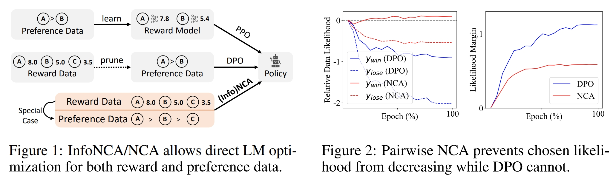

# Noise Contrastive Alignment of Language Models with Explicit Rewards
<div align="center">
  
[](https://arxiv.org/pdf/2402.05369)&nbsp;
[](https://huggingface.co/collections/ChenDRAG/noise-contrastive-alignment-model-and-dataset-65c49b9cb25522fdb035a206)&nbsp;

</div>

<p align="center">

<p>

This repo contains training scripts used in
> [**Noise Contrastive Alignment of Language Models with Explicit Rewards**](https://arxiv.org/pdf/2402.05369)<br>
<br>
> Huayu Chen, Guande He, Lifan, Yuan, Ganqu Cui, Hang Su, and Jun Zhu
> <br>Tsinghua<br>

We enable alignining a pretrained language model with datasets annotated by explicit rewards instead of just binary preferecne by introducing Noise Contrastive Alignment (Figure 1). This framework includes two general algorithms (NCA and InfoNCA) that can deal with both preference data and reward data. Notably, we find that InfoNCA incorporate DPO loss as a special case in binary preference settings. Compared with DPO/InfoNCA, the main advantage of NCA is that it effectively prevents the chosen likelihood from decreasing, a phenomenon commonly observed when applying DPO/InfoNCA loss (Figure 2). 

In this repo, we release:
* The training scripts of NCA/InfoNCA for aligning Mistral-7B model using [UltraFeedback](https://huggingface.co/datasets/openbmb/UltraFeedback) Dataset.
* Pretrained model weights.

## Update
- [2024.06] [Dataset](https://huggingface.co/collections/ChenDRAG/noise-contrastive-alignment-model-and-dataset-65c49b9cb25522fdb035a206) and training code is released.
- [2024.05] The pairwise preference version of NCA has now been supported by [trl](https://github.com/huggingface/trl) library.
- [2024.04] NCA algorithm helps empower [Eurus-70B](https://github.com/OpenBMB/Eurus) and [Eurus-8*7B](https://github.com/OpenBMB/Eurus) model, demonstrating significant advantages in complex reasoning tasks compared to the DPO algorithm. Eurus-70B outperformed GPT-3.5-Turbo in a comprehensive benchmark across 12 tests covering five different tasks.
- [2024.03] Pretrained model [weights](https://huggingface.co/collections/ChenDRAG/noise-contrastive-alignment-model-and-dataset-65c49b9cb25522fdb035a206) are released.


## Getting Started

### Set up environments
```
cd alignment-handbook; pip install -e .
```
and 
```
cd trl; pip install -e .
```

### Train
Before running, please determine your avaliable training device numbers and change `gradient_accumulation_steps` for an appropriate global batch size. We use 8*A40 GPUs and a global batch size of 32 by default. 

For aligning with reward dataset, run
```
NCCL_P2P_DISABLE=1 ACCELERATE_LOG_LEVEL=info accelerate launch --config_file alignment-handbook/recipes/accelerate_configs/multi_gpu.yaml --num_processes=8 --main_process_port=7000 run_reward.py yamls/reward_qlora.yaml --gradient_accumulation_steps=4 --beta=0.01 --loss_type=[NCA/InfoNCA] --output_dir=data/test_run
```

For aligning with preference dataset (binarized UltraFeedback), run
```
NCCL_P2P_DISABLE=1 ACCELERATE_LOG_LEVEL=info accelerate launch --config_file alignment-handbook/recipes/accelerate_configs/multi_gpu.yaml --num_processes=8 --main_process_port=7000 run_preference.py yamls/preference_qlora.yaml --gradient_accumulation_steps=4 --beta=0.01 --loss_type=[NCA/DPO] --output_dir=data/test_run
```

### Evaluation
Check out [alignment-handbook instructions](https://github.com/huggingface/alignment-handbook/tree/main/scripts#evaluating-chat-models) for evaluating models on [MT-bench](https://huggingface.co/spaces/lmsys/mt-bench) and [AlpacaEval](https://github.com/tatsu-lab/alpaca_eval).

## License
MIT


## BibTeX
```bibtex
@article{chen2024noise,
  title={Noise contrastive alignment of language models with explicit rewards},
  author={Chen, Huayu and He, Guande and Yuan, Lifan and Cui, Ganqu and Su, Hang and Zhu, Jun},
  journal={arXiv preprint arXiv:2402.05369},
  year={2024}
}
```
